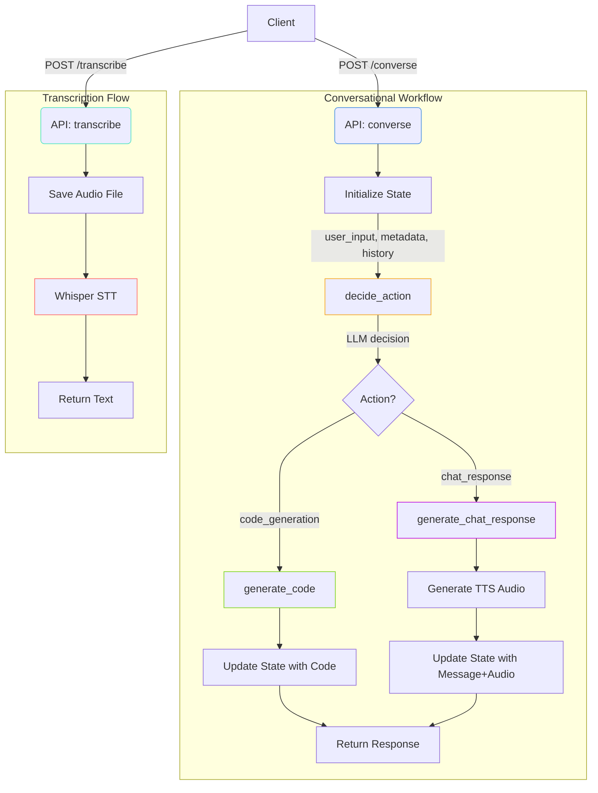

# AI Voice Assistant for Data Visualization & Manipulation


Voice-enabled AI assistant that helps with data visualization and manipulation through natural language commands, powered by state-of-the-art language models and **LangGraph** workflows.

## 🛠️ Technical Stack

### Core Components
- **Backend**: `FastAPI` (Python)
- **Workflow Engine**: `LangGraph`
- **LLM Serving**: `vLLM`
- **Speech-to-Text**: `Whisper` (medium.en)
- **Text-to-Speech**: `VITS` (VCTK voices)

### Models
| Component | Model | Specification |
|-----------|-------|---------------|
| STT | Whisper | `medium.en` |
| LLM | Qwen2.5-Coder | `32B-Instruct-AWQ` |
| TTS | VITS | `tts_models/en/vctk/vits` (speaker p225) |


## ✨ Key Features

- **Voice Interface**: Speech-to-text and text-to-speech capabilities
- **Intelligent Workflows**: LangGraph-powered decision making
- **Code Generation**: Automatic Python code generation for data tasks
- **Conversational AI**: Context-aware chat responses
- **High Performance**: Optimized inference with vLLM


## 🗂 Project Structure
```bash
ai-voice-assistant/
├── api.py # FastAPI endpoints
├── models.py # Model loading and inference
├── prompts.py # Prompt templates
├── schemas.py # Type definitions and Pydantic models
├── workflow.py # LangGraph workflow definition
└── README.md
```

## 🛠️ Workflow Graph:




## 🚀 Getting Started

### Prerequisites
- Python 3.9+
- NVIDIA GPU with CUDA support at least 30 GB (I used `NVIDIA RTX 6000 Ada Generation 48GB VRAM`) 
- Docker (recommended)

### Installation
```bash
git clone https://github.com/your-repo/Voice-to-Pandas-LLM-backend.git
cd Voice-to-Pandas-LLM-backend
pip install -r requirements.txt
```

then run the API using:
```bash
CUDA_VISIBLE_DEVICES=0 uvicorn api:app --host 0.0.0.0 --port 6000
```
